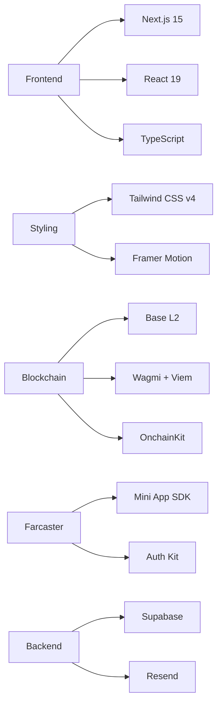
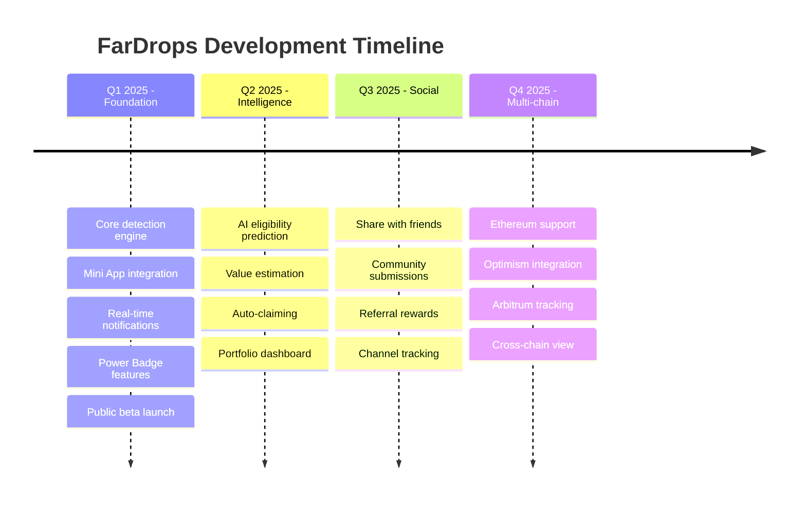

# 🎁 FarDrops

<div align="center">
  
  
  
  <p align="center">
    <strong>Never miss another Farcaster airdrop again.</strong>
  </p>
  
  <p align="center">
    The first dedicated airdrop tracker built specifically for the Farcaster ecosystem.
    <br />
    Track DEGEN, Clanker tokens, NFT drops, and more—all in one place.
  </p>

  <!-- Animated typing SVG -->
  <p align="center">
    
  </p>

  <!-- Live Status Badges -->
  <p align="center">
    
    
    
    
    
  </p>

  <p align="center">
    <a href="https://fardrops.xyz">
      
    </a>
    <a href="https://warpcast.com/fardrops">
      
    </a>
    <a href="#-built-on-base">
      
    </a>
  </p>

  <!-- GitHub Profile Stats -->
  <details>
    <summary>👨‍💻 <b>About the Builder</b></summary>
    <br />
    <p align="center">
      
    </p>
    <p align="center">
      
    </p>
    <p align="center">
      
    </p>
  </details>

  <!-- Interactive Menu -->
  <p align="center">
    <a href="#-why-fardrops">
      
    </a>
    <a href="#-key-features">
      
    </a>
    <a href="#-quick-start">
      
    </a>
    <a href="#-tech-stack">
      
    </a>
    <a href="#-roadmap">
      
    </a>
  </p>
</div>

---

## 🌟 Why FarDrops?

<div align="center">
  
</div>

The Farcaster ecosystem is exploding with opportunities—new tokens launching daily through Clanker, exclusive NFT drops for Power Badge holders, and community airdrops happening across channels. **But keeping track of it all? Nearly impossible.**

FarDrops solves this by automatically monitoring the entire Farcaster network, detecting airdrops in real-time, and notifying you instantly when you're eligible.

<div align="center">
  <table>
    <tr>
      <td align="center">
        
        <br />
        <sub><b>Clanker Tokens Daily</b></sub>
      </td>
      <td align="center">
        
        <br />
        <sub><b>Major Tokens</b></sub>
      </td>
      <td align="center">
        
        <br />
        <sub><b>Active Channels</b></sub>
      </td>
      <td align="center">
        
        <br />
        <sub><b>Monitoring</b></sub>
      </td>
    </tr>
  </table>
</div>

## ✨ Key Features

<details open>
<summary><b>🔍 Automated Detection</b></summary>

- 🤖 Real-time monitoring of Farcaster channels and casts
- ⛓️ Smart contract event tracking on Base
- 🖼️ Frame metadata analysis for interactive airdrops
- 🦾 Clanker bot monitoring (250+ new tokens daily)
</details>

<details open>
<summary><b>📱 Farcaster Native</b></summary>

- 🎯 Built as a Farcaster Mini App—use it directly in your feed
- 🔐 One-click wallet connection with Farcaster auth
- 🏆 Power Badge holder exclusive tracking
- 👥 Social proof from your network
</details>

<details open>
<summary><b>🔔 Instant Notifications</b></summary>

- 📲 In-app alerts through Farcaster
- 💬 Discord webhook integration
- 📨 Telegram bot notifications
- 📧 Email alerts (optional)
</details>

<details open>
<summary><b>💎 Eligibility Checking</b></summary>

- ✅ Automatic wallet eligibility verification
- 🆔 FID-based qualification tracking
- 📊 Historical activity analysis
- 🏪 Channel membership verification
</details>

## 🛠 Tech Stack

<div align="center">
  <table>
    <tr>
      <td align="center">
        
        <br />
        <sub><b>Next.js 15</b></sub>
      </td>
      <td align="center">
        
        <br />
        <sub><b>TypeScript</b></sub>
      </td>
      <td align="center">
        
        <br />
        <sub><b>Tailwind CSS</b></sub>
      </td>
      <td align="center">
        
        <br />
        <sub><b>React 19</b></sub>
      </td>
      <td align="center">
        
        <br />
        <sub><b>Vercel</b></sub>
      </td>
      <td align="center">
        
        <br />
        <sub><b>Supabase</b></sub>
      </td>
    </tr>
  </table>
</div>

### Core Technologies



## 🚀 Quick Start

### Prerequisites

```bash
# Required
node >= 18.0.0
npm >= 9.0.0
```

### Installation

<details>
<summary><b>📥 Clone & Install</b></summary>

```bash
# Clone the repository
git clone https://github.com/JSONbored/fardrops.git
cd fardrops

# Install dependencies
npm install

# Copy environment variables
cp .env.example .env.local

# Configure your .env.local
nano .env.local
```
</details>

<details>
<summary><b>🔑 Environment Setup</b></summary>

```env
# Farcaster
FARCASTER_HUB_URL=https://hub-grpc.pinata.cloud

# Base/Ethereum
NEXT_PUBLIC_ONCHAINKIT_API_KEY=your_key_here
NEXT_PUBLIC_WALLET_CONNECT_PROJECT_ID=your_project_id

# Database
NEXT_PUBLIC_SUPABASE_URL=your_supabase_url
NEXT_PUBLIC_SUPABASE_ANON_KEY=your_anon_key
SUPABASE_SERVICE_KEY=your_service_key

# Notifications (Optional)
RESEND_API_KEY=your_resend_key
TELEGRAM_BOT_TOKEN=your_bot_token
DISCORD_WEBHOOK_URL=your_webhook_url
```
</details>

<details>
<summary><b>🚀 Development</b></summary>

```bash
# Start development server
npm run dev

# Build for production
npm run build

# Run tests
npm test

# Lint & format
npm run lint
npm run format
```
</details>

## 📦 Project Structure

```
fardrops/
├── 📱 app/                    # Next.js App Router
│   ├── api/                  # API endpoints
│   │   ├── airdrops/         # Airdrop CRUD
│   │   ├── monitor/          # Monitoring engine
│   │   └── webhooks/         # Webhook handlers
│   ├── layout.tsx            # Root layout
│   └── page.tsx              # Landing page
├── 🧩 components/            # React components
├── 🔧 lib/                   # Utilities
├── 🌐 public/
│   └── .well-known/
│       └── farcaster.json    # Mini App manifest
└── 💾 supabase/              # Database schema
```

## 🗺 Roadmap

<div align="center">



</div>

## 🤝 Contributing

<div align="center">
  
</div>

We love contributions! FarDrops is built by [JSONbored](https://github.com/JSONbored) for the Farcaster community.

### How to Contribute

1. 🍴 **Fork** the repository
2. 🌿 **Create** your feature branch (`git checkout -b feature/AmazingFeature`)
3. 💾 **Commit** your changes (`git commit -m 'Add some AmazingFeature'`)
4. 📤 **Push** to the branch (`git push origin feature/AmazingFeature`)
5. 🎯 **Open** a Pull Request

### Development Guidelines

- ✨ Write clean, documented code
- 🎨 Follow the existing code style
- 🧪 Add tests for new features
- 📚 Update documentation as needed

## 🏗 Base Summer League

<div align="center">
  
  
  <p>
    <b>Current Rank: #384</b> | <b>Target: Top 100</b>
  </p>
  
  <p>
    FarDrops is proudly participating in the <a href="https://base.mirror.xyz/S8mQ_fOh-7DhvgHXlR7v01HRRLqAKVxKdxEEUkYxhyY">Base Summer League Builder Rewards</a> program.
  </p>
</div>

## 📊 Project Stats

<div align="center">
  
</div>

## 🎨 Brand Kit

<div align="center">
  <table>
    <tr>
      <td align="center">
        
        <br />
        <sub><b>App Icon</b></sub>
      </td>
      <td align="center">
        
        <br />
        <sub><b>Logo</b></sub>
      </td>
      <td align="center">
        
        <br />
        <sub><b>Social Card</b></sub>
      </td>
    </tr>
  </table>
  
  **Color Palette**
  
   `#8B5CF6` Primary Purple
   `#1a1a2e` Dark Background
   `#FF6B6B` Accent Red
   `#4ECDC4` Accent Teal
</div>

## 📄 License

<div align="center">
  
  
  This project is licensed under the MIT License - see the [LICENSE](LICENSE) file for details.
</div>

## 🙏 Acknowledgments

<div align="center">
  <table>
    <tr>
      <td align="center">
        <a href="https://farcaster.xyz">
          
        </a>
      </td>
      <td align="center">
        <a href="https://base.org">
          
        </a>
      </td>
      <td align="center">
        <a href="https://onchainkit.xyz">
          
        </a>
      </td>
      <td align="center">
        <a href="https://clanker.world">
          
        </a>
      </td>
    </tr>
  </table>
</div>

## 📞 Support & Community

<div align="center">
  
  **Need help? Found a bug? Have a feature request?**
  
  <p>
    <a href="https://warpcast.com/fardrops">
      
    </a>
    <a href="https://github.com/JSONbored/fardrops/issues">
      
    </a>
    <a href="https://discord.gg/fardrops">
      
    </a>
  </p>
  
</div>

---

<div align="center">
  
  
  <p>
    <strong>Built with 💜 by <a href="https://github.com/JSONbored">JSONbored</a></strong>
  </p>
  
  <p>
    
    
  </p>
  
  <p>
    <sub>⭐ Star this repo if you find it useful!</sub>
  </p>
  
  <p>
    <a href="https://www.buymeacoffee.com/jsonbored">
      
    </a>
  </p>
</div>